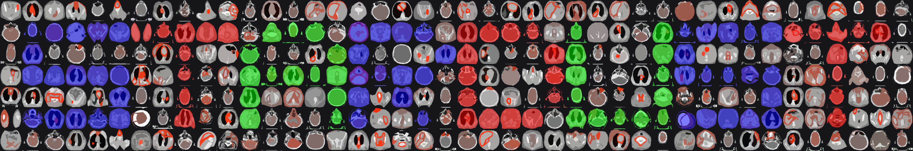

# 🌟 STARDUST: AI-Powered Segmentation & Clinical Data Processing 🌟

## 🔍 Overview

**STARDUST** (Segmentation of Tumors via AI-powered Radiotherapy Database Utilization using AI Technology) is a comprehensive framework designed to streamline tumor segmentation, data extraction from treatment planning systems (TPS), and dataset preparation for AI training. The project consists of multiple components, each targeting a specific aspect of medical image processing and clinical data handling.

This repository serves as the central hub for the STARDUST ecosystem, containing multiple submodules that work together to improve segmentation workflows, enhance case selection, and facilitate AI training using real-world radiotherapy data.

## 📂 Repository Structure

The STARDUST repository consists of the following core submodules:

### 1️⃣ **STARDUST-MedSAM2**
A customized version of the **Segment Anything Model 2 (SAM2)** adapted for tumor segmentation in radiotherapy planning. This module includes fine-tuning methods, evaluation tools, and a GUI for interactive segmentation. 

🔗 **[More details](./STARDUST_MedSAM-MG/README.md)**

---

### 2️⃣ **STARDUST-TPS-Mining** 🏥
A Python script for **data mining** within the **Eclipse Treatment Planning System (TPS)** to extract relevant cases for training **STARDUST-MedSAM2**. It performs the following tasks:
- Searches for relevant radiotherapy cases based on clinical parameters
- Extracts segmentation metrics into an **Excel file**
- Captures **planning CT, contrast-enhanced CT (KM-CT), and MRI** screenshots with tumor contours (optionally including dose distribution)

🔗 **[More details](./STARDUST-TPS-Mining/README.md)**

---

### 3️⃣ **STARDUST-Case-Selector** 🎛️
A **Python GUI tool** to review extracted cases and determine their suitability for AI training. This module allows for:
- **Parallel image review** of Planning CT, KM-CT, and MRI
- **Selection and labeling** of cases for training
- **Advanced filtering** to refine TPS-mined cases based on clinical criteria

🔗 **[More details](./STARDUST_CaseSelector/README.md)**

---

### 4️⃣ **STARDUST-Data-Exporter** 📤
A structured data export pipeline that **converts the selected cases from TPS into a format compatible with STARDUST-MedSAM2**. This module:
- Reads the labeled selections from **STARDUST-Case-Selector**
- Extracts **DICOM images and contours** from TPS
- Prepares data for **STARDUST-MedSAM2 training**

🔗 **[More details](./STARDUST-Data-Exporter/README.md)**

---

## 🔮 Future Development
- ✅ **Automated DICOM export pipeline**
- ✅ **TPS integration for direct case selection from Eclipse**
- 🔜 **AI-assisted case filtering and selection**

---

## 📚 Citation

If you use STARDUST in your research, please cite this repository.

---

## 📝 License

This project is licensed under the MIT License - see the LICENSE file for details.

## 🙏 Acknowledgments

- This project builds upon [MedSAM2](https://github.com/bowang-lab/MedSAM/tree/MedSAM2) by Bo Wang's Lab
- SAM2 developed by Meta Platforms, Inc.

## 🏦 Funding

STARDUST is sponsored by the Federal Ministry of Education and Research (Bundesministerium für Bildung und Forschung, BMBF) as part of the “DataXperiment – Innovative Data Use in Cancer Research and Care” initiative within the National Decade Against Cancer (Nationale Dekade gegen Krebs).
Funding Code: 01KD2438
Project Duration: October 2024 – March 2025

About the Initiative:
DataXperiment promotes short-term projects that explore innovative applications of already available, structured, and annotated data in oncology.

  

