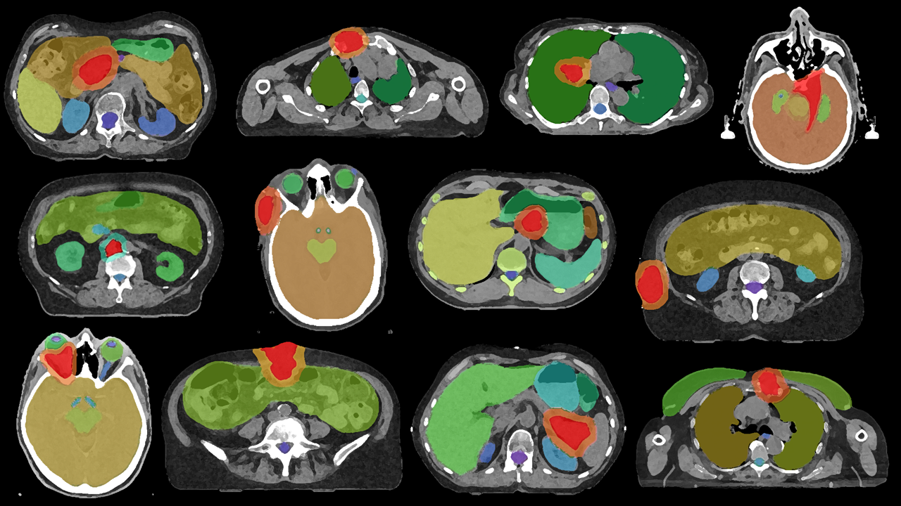

# 📤 STARDUST-Data-Exporter



## 🔍 Overview

**STARDUST-Data-Exporter** is a script that facilitates the structured export of **DICOM data** from the **Varian Eclipse Treatment Planning System (TPS)**. This module takes selected cases from **STARDUST-Case-Selector** and ensures that relevant structures are created within Eclipse before exporting data for use with **STARDUST-MedSAM2**. Since structure sets are modified, the script must be **explicitly approved in the clinical system** before execution.

While the **STARDUST-Data-Exporter** modifies structure sets, the actual **DICOM file export** can also be performed via a **read-only script using DCMTK**. 

For more information on scripting DICOM exports using **DCMTK**, refer to:
- 📄 **[Varian-Code-Samples: Scripting the Varian DICOM DB Daemon with ESAPI](https://github.com/VarianAPIs/Varian-Code-Samples/wiki/Scripting-the-Varian-DICOM-DB-Daemon-with-ESAPI)**

## 📂 How It Works

1️⃣ **Review Selected Cases**
   - Reads labeled cases from the **STARDUST-Case-Selector** output file.
   - Extracts **Patient ID** and **Plan ID** to locate cases in Eclipse.

2️⃣ **Modify Structure Sets** (Requires Clinical Approval)
   - Creates or refines **GTV structures** to align with the labeling system for **STARDUST-MedSAM2**.
   - Ensures that the exported segmentations are consistent with AI training needs.

3️⃣ **Prepare for DICOM Export**
   - Retrieves **CT, contrast-enhanced CT (KM-CT), MRI, and structure sets**.
   - Outputs a list of cases ready for **DICOM export**.

4️⃣ **DICOM File Export** (via DCMTK or ESAPI)
   - Users can **either** export via **Varian’s DICOM DB Daemon** (read-only using DCMTK) or execute a standard **ESAPI script**.

## 🚀 Installation

### 1️⃣ Clone the repository:
```bash
git clone https://github.com/yourusername/STARDUST.git
cd STARDUST-Data-Exporter
```

### 2️⃣ Compile the project:
Since this is a **C# project**, you need to **compile it first**:
- Open the project in **Visual Studio**.
- Build the project in **Debug mode**.
- Navigate to the **Debug folder** after compilation.

### 3️⃣ Run the script:
```bash
STARDUST-Data-Exporter.exe
```
*(Found in the Debug folder after compilation)*

## 📖 Important Notes
- **Requires Clinical Approval**: The script modifies **structure sets**, which must be explicitly **approved** in the clinical TPS before execution.
- **DICOM Export Options**:
  - **DCMTK (Read-Only Method)**: Uses Varian’s DICOM DB Daemon for safe, **read-only** extraction.
  - **ESAPI-Based Export**: Allows structured export using **approved Eclipse scripting**.

## 🔄 Workflow Integration

This module is part of the **STARDUST** ecosystem:

🔗 **[Main STARDUST Repository](../README.md)**

🔹 **STARDUST-TPS-Mining** → Extracts cases from TPS 🔄  
🔹 **STARDUST-Case-Selector** → Reviews and filters cases 🔄  
🔹 **STARDUST-Data-Exporter** → Converts selected cases into training-ready datasets 🔄  
🔹 **STARDUST-MedSAM2** → Uses the processed datasets for AI-powered tumor segmentation  

## 📝 License

This project is licensed under the MIT License - see the LICENSE file in the root directory for details.

## 🙏 Acknowledgments

- Part of the **STARDUST** ecosystem  
- Developed for **structured DICOM export in radiotherapy AI workflows**
