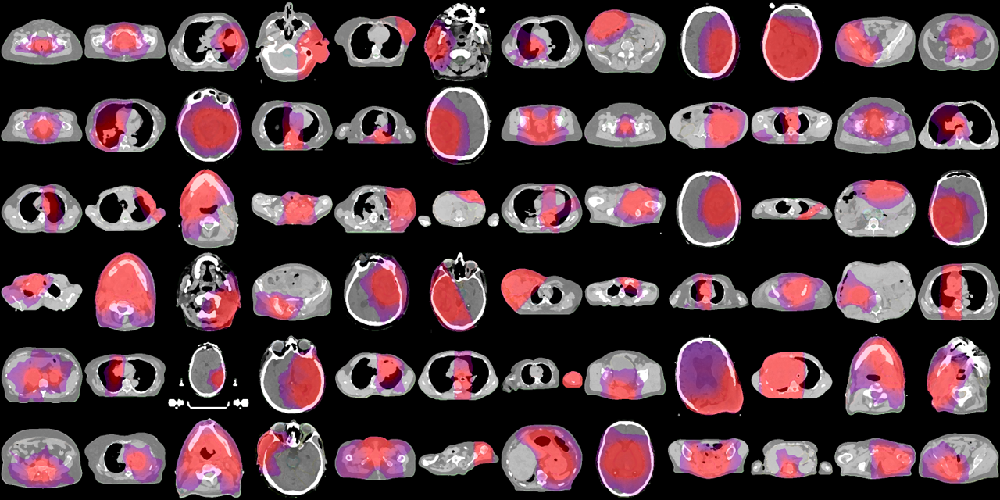

# 🏥 STARDUST-TPS-Mining



## 🔍 Overview

**STARDUST-TPS-Mining** is a script designed to extract relevant radiotherapy cases from a **Varian Eclipse Treatment Planning System (TPS)**. The script identifies cases suitable for training **STARDUST-MedSAM2**, exports relevant metadata to an **Excel file**, and generates **annotated image slices** from planning CT, contrast-enhanced CT (KM-CT), and MRI scans. Additionally, it calculates **Hounsfield Unit (HU) statistics** for tumor regions to assess their imaging properties.

This tool enables efficient data mining by:
- Identifying **gross tumor volume (GTV)** structures.
- Extracting **treatment plan details** (e.g., dose, fractionation, target volume).
- Generating **screenshot overlays** with tumor contours (optional: dose distribution using `SaveContourAsPNGwithDose`).
- Computing **HU values (mean, standard deviation, relative variation)**.
- Saving results to an **Excel-compatible format** for further analysis.

## 📂 How It Works

1️⃣ **Load Excel File with Candidate Cases**
   - The script reads patient and plan IDs from a predefined **Excel file** (e.g., `PlansWithGTV_filtered_Mine.xlsx`).
   - Cases are filtered based on **target volume (GTV)**, treatment status, and dose coverage.
   - If no Excel file is provided, the script can iterate over **all patients** in the TPS database.

2️⃣ **Extract Patient & Treatment Plan Data**
   - Accesses **patient records** in Varian Eclipse TPS.
   - Retrieves **plan setup, dose information, and target volume**.
   - Extracts the last **treatment date** for inclusion.

3️⃣ **Compute HU Statistics**
   - Determines **HU values** for the middle tumor slice.
   - Outputs **mean HU, standard deviation, and relative variation**.

4️⃣ **Generate Annotated Image Slices**
   - Creates **middle-slice screenshots** of **planning CT, KM-CT, and MRI**.
   - Overlays tumor contours and other relevant structures.
   - Optionally overlays **dose distribution** using `SaveContourAsPNGwithDose`.
   - Saves images as **PNG files** in an output directory.

5️⃣ **Export to CSV/Excel**
   - Saves extracted case data as a **structured CSV file**.
   - Converts CSV to **Excel format** for compatibility.

## 🚀 Installation

### 1️⃣ Clone the repository:
```bash
git clone https://github.com/yourusername/STARDUST.git
cd STARDUST-TPS-Mining
```

### 2️⃣ Compile the project:
Since this is a **C# project**, you need to **compile it first**:
- Open the project in **Visual Studio**.
- Build the project in **Debug mode**.
- Navigate to the **Debug folder** after compilation.

### 3️⃣ Run the script:
```bash
STARDUST-TPS-Mining.exe
```
*(Found in the Debug folder after compilation)*

## 📊 Excel Input Format
The script expects an **Excel file** where:
- **Column 1** contains the **Patient ID**.
- **Column 6** contains the **Plan ID**.

Alternatively, if no Excel file is provided, the script can iterate over **all patients** in the TPS database using `foreach (var patientSummary in app.PatientSummaries.Reverse())`.

## 📖 Resources for ESAPI Beginners
For those new to the **Eclipse Scripting API (ESAPI)**, the following resources provide useful guidance:
- 📘 **Varian API Book** (available in `assets/VarianApiBook.pdf`)
- 🌍 [ESAPI Subreddit](https://www.reddit.com/r/esapi/)
- 🔗 [Varian Medical Affairs - ESAPI Projects](https://medicalaffairs.varian.com/esapi-projects)

## 📊 Output Data Structure

Each mined case is stored as a row in the **output file**, including:

| Patient-ID | Plan-ID | Target-Volume | GTV Volume (cm³) | Mean HU | HU StdDev | RelVar HU | PNG Screenshot |
|-----------|--------|--------------|-----------------|--------|---------|----------|--------------|
| P12345 | Plan1  | GTV1         | 52.4            | 35.2   | 12.1    | 3.5%     | P12345_GTV1.png |

## 🔄 Workflow Integration

This module is part of the **STARDUST** ecosystem:

🔗 **[Main STARDUST Repository](../README.md)**

🔹 **STARDUST-TPS-Mining** → Extracts cases from TPS 🔄  
🔹 **STARDUST-Case-Selector** → Reviews and filters cases 🔄  
🔹 **STARDUST-Data-Exporter** → Converts selected cases into training-ready datasets 🔄  
🔹 **STARDUST-MedSAM2** → Uses the processed datasets for AI-powered tumor segmentation  

## 🔮 Future Improvements

- 🔄 **Direct integration with Eclipse TPS via custom DICOMnode**.

## 📝 License

This project is licensed under the MIT License - see the LICENSE file in the root directory for details.

## 🙏 Acknowledgments

- Part of the **STARDUST** ecosystem  
- Developed for **automated clinical data mining in radiotherapy**
