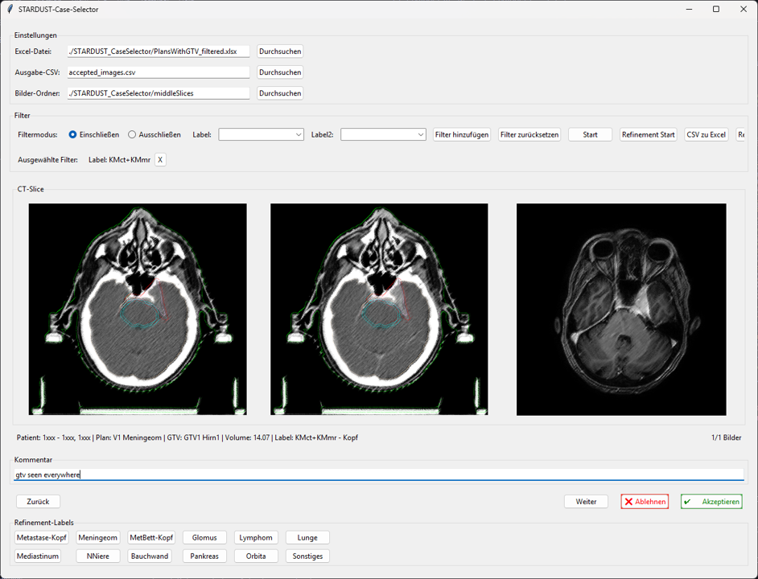

# 🎛️ STARDUST-Case-Selector



## 🔍 Overview

**STARDUST-Case-Selector** is a graphical user interface (GUI) tool designed to help users efficiently review, label, and filter radiotherapy cases extracted from a treatment planning system (TPS). The goal is to curate high-quality training data for **STARDUST-MedSAM2**, ensuring that only relevant and well-annotated cases are included in the AI training process.

This tool allows users to:
- Visually inspect planning CT, contrast-enhanced CT (KM-CT), and MRI images side by side.
- Filter and refine cases based on specific criteria.
- Assign labels to cases that will later be used for AI training.
- Export selected cases in a structured format for use in **STARDUST-MedSAM2**.

## 📂 How It Works

1️⃣ **Load Case Data**
   - The tool reads case metadata from an Excel file.
   - Image paths and associated tumor labels are loaded for visual review.

2️⃣ **Interactive Case Selection**
   - Users can navigate through cases, inspecting planning CT, KM-CT, and MRI images in parallel.
   - Cases can be accepted, rejected, or refined with additional labels.

3️⃣ **Filtering & Labeling**
   - Users can apply filters to prioritize certain tumor types or anatomical locations.
   - Labels can be assigned to indicate whether a case is suitable for AI training.

4️⃣ **Export to Training Dataset**
   - Once curated, the selected cases are structured into an output file.
   - This file serves as the basis for the **STARDUST-Data-Exporter**, which retrieves full-resolution DICOM images for **STARDUST-MedSAM2**.

## 🚀 Installation

```bash
# Clone repository
git clone https://github.com/yourusername/STARDUST.git
cd STARDUST-Case-Selector

# Install dependencies
pip install -r requirements.txt
```

## 🖥️ Usage

Run the GUI tool:
```bash
python STARDUST-Case-Selector.py
```

## 🛠 Features

- 📂 **Multi-modal image review** (Planning CT, KM-CT, and MRI)
- ✅ **Accept/reject cases** based on quality and relevance
- 🏷 **Label assignment** to guide AI training
- 🔎 **Advanced filtering** to refine selection criteria
- 📊 **Export structured datasets** for **STARDUST-MedSAM2** training

## 🔄 Workflow Integration

The STARDUST-Case-Selector is part of the **STARDUST** ecosystem:

🔗 **[Main STARDUST Repository](../README.md)**

🔹 **STARDUST-TPS-Mining** → Extracts cases from TPS 🔄  
🔹 **STARDUST-Case-Selector** → Reviews and filters cases 🔄  
🔹 **STARDUST-Data-Exporter** → Converts selected cases into training-ready datasets 🔄  
🔹 **STARDUST-MedSAM2** → Uses the processed datasets for AI-powered tumor segmentation  

## 🔮 Future Improvements

- 🔄 **AI-assisted case filtering** based on pre-trained models
- 📊 **Automatic quality assessment** for segmentation consistency
- 🚀 **Integration with TPS for real-time case selection**

## 📚 Citation

If you use STARDUST-Case-Selector in your research, please cite:

```
@article{STARDUST-Case-Selector,
  title={STARDUST: AI-Powered Tumor Segmentation and Case Selection},
  author={Your Name},
  journal={Your Journal},
  year={2025}
}
```

## 📝 License

This project is licensed under the MIT License - see the LICENSE file for details.

## 🙏 Acknowledgments

- Part of the **STARDUST** ecosystem
- Developed for **AI-driven segmentation in radiotherapy**
