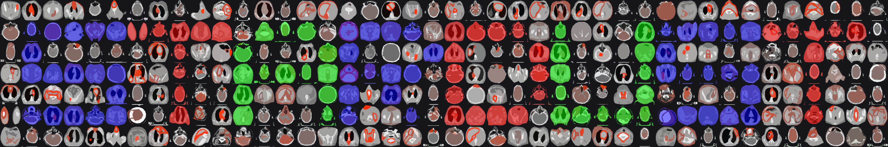
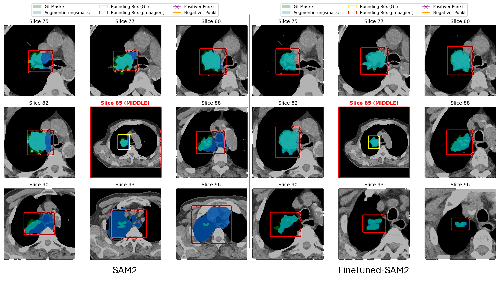
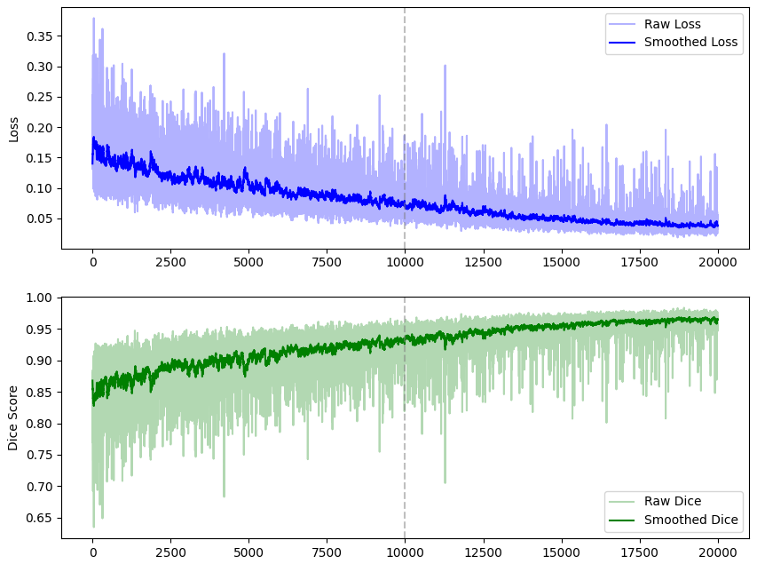
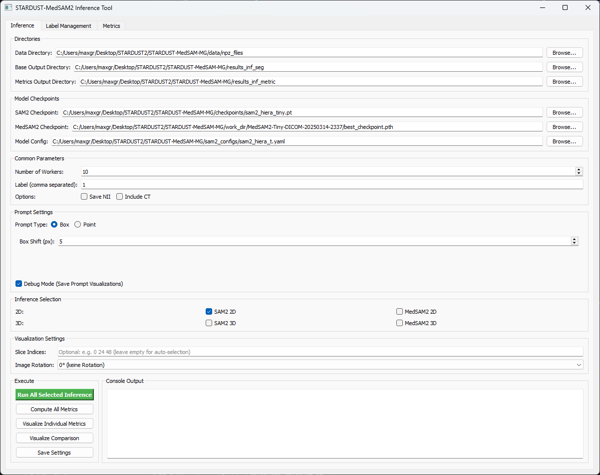
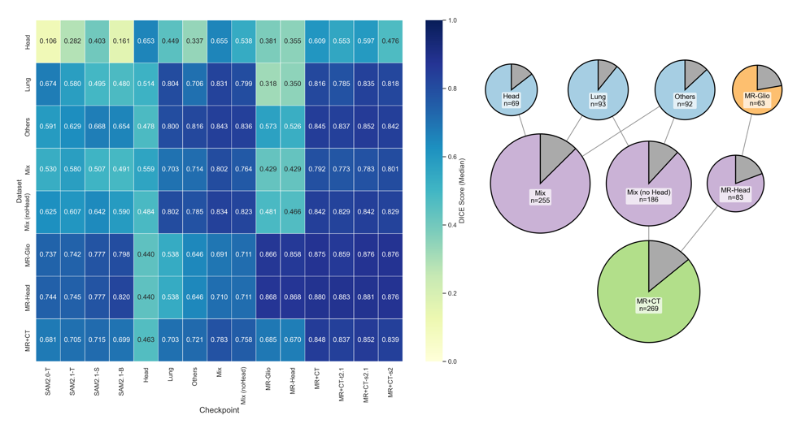
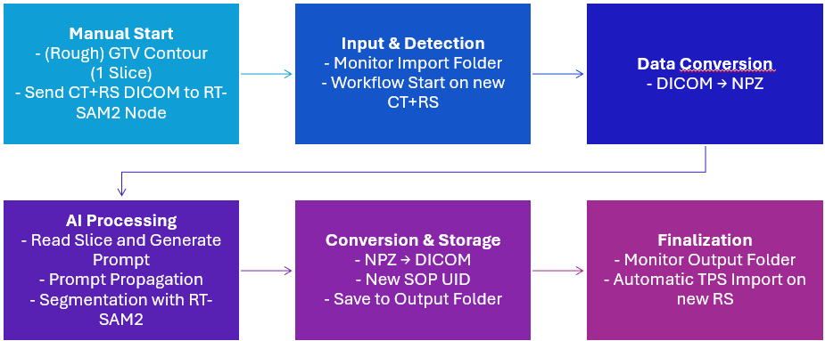

# 🌟 STARDUST-MedSAM2 🌟

<div align="center">  </div>

🔗 **[Main STARDUST Repository](../README.md)**

## 🔍 Project Overview

STARDUST (Segmentation of Tumors via AI-powered Radiotherapy Database Utilization using Segment Anything Model 2 Technology) is an advanced medical imaging segmentation framework designed to enhance tumor segmentation in radiotherapy planning. Building upon Meta's state-of-the-art SAM2 foundation model (released July 31, 2024), STARDUST-MedSAM2 extends these capabilities to medical imaging contexts with specialized adaptation for 3D medical data for radiotherapy (RT).

### 🏥 Why Does This Matter?
Medical imaging plays a crucial role in cancer diagnosis and treatment, with tumor segmentation being a critical task in RT. Traditionally, radiation oncologists manually outline tumors on CT and MRI scans, a time-consuming and highly variable process. While AI has already improved organ segmentation, precise tumor segmentation remains a major challenge. The STARDUST project leverages cutting-edge AI to significantly enhance the speed and consistency of tumor delineation, making RT planning more efficient and precise.

Recent advances in artificial intelligence (AI) have opened new opportunities for medical image segmentation, particularly with interactive medical image segmentation (IMIS). IMIS enhances accuracy by integrating iterative feedback from medical professionals. However, most methods struggle with the limited availability of 3D medical data, making generalization difficult. The Segment Anything Model (SAM) was initially developed for 2D segmentation, requiring extensive manual slice-by-slice annotations when applied to 3D medical imaging. The next-generation SAM2, trained on videos, introduces a paradigm shift by enabling full annotation propagation from a single 2D slice to an entire 3D medical volume. 

STARDUST-MedSAM2 builds upon this capability, leveraging a decade’s worth of radiotherapy treatment data—including 12,000 treatment courses with CT and MRI scans—to refine and optimize tumor segmentation for clinical applications. Unlike traditional medical imaging models that require training on limited datasets, SAM2's foundation on a billion+ annotations allows for superior adaptability. Our goal is to harness these advancements to improve radiotherapy planning, adaptive therapy, and follow-up care.

## 🎨 How STARDUST-MedSAM2 Works: Box Mode and Point Mode Explained
STARDUST-MedSAM2 is designed to make tumor segmentation easier and faster for users by letting them guide the AI with simple inputs. It offers two main ways to do this: Box Mode and Point Mode. Below, we’ll explain how these modes work using examples from real medical images (CT scans) and show why our fine-tuned STARDUST-MedSAM2 is better than the original (vanilla) SAM2 model.

### 📦 Box Mode: Drawing a Box Around the Tumor
In Box Mode, the user draws a rectangular box around the tumor on one slice of a 3D medical scan (like a CT or MRI). This box tells the AI, "The tumor is somewhere in here." The AI then figures out the exact shape of the tumor inside the box and extends this outline to other slices in the 3D scan, creating a full 3D picture of the tumor.

**How It Looks:**
Check out the following picture below. It shows 9 slices of a CT scan (Slices 75 to 96). The yellow box is the "ground truth" (the expert-drawn tumor area), and the red box is what the AI predicts and carries across slices. The light blue area inside the box is the AI’s guess at the tumor’s shape.

<div align="center">  <p> <p><strong>Image 1:</strong> Box Mode in action across 15 brain CT slices. Yellow box = expert outline, red box = AI’s propagated box, light blue = AI’s tumor prediction.</p> </div>

### 📍 Point Mode: Pointing at the Tumor
In Point Mode, the user clicks a point inside the tumor (a "positive point") to say, "This is part of the tumor," and can add a point outside (a "negative point") to say, "This isn’t the tumor." The AI uses these hints to draw the tumor’s shape and extend this information across the 3D scan via box propagation like before.

**How It Looks:**
Look at the following picture below. It compares the vanilla SAM2 (left) and our fine-tuned STARDUST-MedSAM2 (right) across 9 slices of a CT scan (Slices 56 to 102). In Slice 79 (middle), you’ll see several purple crosses (positive points, may be hard to see due to image anonymization but clearer in real scans) inside the tumor and yellow stars (negative points) outside. For STARDUST-MedSAM2 (right), the light blue tumor shape matches the green expert outline almost perfectly, showing it listens to the points well. The vanilla SAM2 (left) gets it wrong, making the tumor too big even with the negative point telling it to stop.

<div align="center">  <p> <p><strong>Image 2:</strong> Point Mode comparison. Left = Vanilla SAM2, Right = STARDUST-MedSAM2. Green = expert outline, light blue = AI prediction, purple cross = positive point, yellow star = negative point.</p> </div>

> *This implementation adapts and extends the approach from [MedSAM2](https://github.com/bowang-lab/MedSAM/tree/MedSAM2), optimizing it for radiotherapy applications with a specific focus on gross tumor volume (GTV) segmentation.*

### 🔄 How the Box Moves Through the Scan  
STARDUST-MedSAM2 helps users identify tumors in 3D medical scans by starting with a small hint—either a box or points—and propagating this hint through all slices of the scan. But how exactly does it work? Here’s a simple explanation for both modes:

### 📦 Box Mode: The Box Leads the Way  
- **Start:** The user draws a box around the tumor on one slice (usually the middle one).  
- **Finding the Shape:** The AI looks inside the box and outlines the exact shape of the tumor.  
- **Moving Forward:** For the next slice, the AI takes this shape, draws a new box around it, and finds the tumor again. It repeats this process slice by slice, adjusting the box if the tumor changes.  
- **In short:** The AI follows the box like a guide and updates it at every step.  

### 📍 Point Mode: From Points to a Box  
- **Start:** The user clicks on points—e.g., inside the tumor (“this is it”) and possibly outside (“this is not it”).  
- **Finding the Shape:** The AI uses the points to outline the tumor and then creates a box around it.  
- **Moving Forward:** With this box, the AI proceeds to the next slice, finds the tumor again, and adjusts the box—just like in Box Mode.  
- **In short:** The points initiate the process, but the AI still uses a box to track the tumor.  

### Why This Matters  
In both modes, the AI takes your hint and propagates it through the entire 3D scan by adapting the box slice by slice. This way, a small input turns into a complete 3D tumor map!

### 🌟 Why STARDUST-MedSAM2 Beats Vanilla SAM2
Our fine-tuned STARDUST-MedSAM2 isn’t just a copy of SAM2—it’s been trained on tumor contours from a radiotherapy clinical database.

## 🚀 Features

- 🏥 **Medical Image Processing**: Specialized conversion from DICOM to NPZ format for optimal model compatibility
- 🧠 **Advanced Segmentation Methods**: 
  - ✅ SAM2 2D segmentation with middle-slice propagation (box and point mode)
  - ✅ MedSAM2 2D segmentation with middle-slice propagation (box and point mode)
  - ✅ SAM2 3D propagation-based segmentation
  - ✅ MedSAM2 3D propagation-based segmentation (in testing)
- 🎯 **Interactive GUI**: User-friendly interface for prompt-based segmentation
- 📊 **Comprehensive Evaluation**: Metrics computation for segmentation quality assessment
- 🔄 **Fine-tuning Capabilities**: Adapt pre-trained models to specific medical datasets

> ⚠️ **Note**: While STARDUST-MedSAM2 can be used for segmenting various anatomical structures including organs, it has been specifically trained and optimized for gross tumor volume (GTV) segmentation in radiotherapy contexts.

## 📦 Installation

```bash
# Clone repository
git clone https://github.com/Kiragroh/STARDUST-MedSAM2.git
cd STARDUST-MedSAM2

# Install dependencies
pip install -e .

# Install PyTorch 2.3.1+
Follow the official guide: [PyTorch Installation](https://pytorch.org/get-started/locally/)

```
[Download here](https://drive.google.com/file/d/18nRQ7KVwAz0wpgf6sqd7hQNuP8AdHdVN/view?usp=sharing) a STARDUST-pretrained model compatible with both CT and MR data.
It was trained for 100 epochs on a dataset of 231 cases.

## 🔄 Data Preparation

### 📂 DICOM to NPZ Conversion

STARDUST-MedSAM2 works with medical images in NPZ format. To convert your DICOM images (use the MR-version for general usage (less dependet on formated csv file)):

```bash
# Using a CSV file (traditional method):
python create_npz_files.py --input_dir /path/to/dicom_folder --output_dir /path/to/npz_output --csv_file /path/to/cases.csv
```

**CSV-based processing**: Uses a CSV file with patient information to locate and process specific DICOM folders

🔜 **Recursive directory scanning**: Automatically finds and processes any directory containing CT and RS DICOM files (multiple CT*.dcm files and one RS*.dcm file)

This utility can process DICOM files from multiple sources, including those exported from TPS systems, and generates pseudonymized data for research purposes.

For training/fine-tuning, convert NPZ to NPY format:

```bash
python npz_to_npy.py -npz_dir ./data/npz_files -npy_dir ./data/npy_data -target_label 1
```

## 🛠️ Model Fine-tuning

Fine-tune the pre-trained models (use resume to continue training). We started with SAM2-tiny for quicker fine-tuning:

```bash
python finetune_sam2_img.py \
    -i <input_directory like ./data/npy_data> \
    -task_name <task_name> \
    -work_dir <work_directory> \
    -batch_size <batch_size like 8> \
    -num_epochs <num_epochs like 100> \
    -pretrain_model_path <pretrain_model_path like sam2_hiera_tiny.pt> \
    -model_cfg <model_config_path like sam2_hiera_t.yaml> \
    -resume <resume_checkpoint_path> \
    -one_label_per_epoch <true_or_false> \
    -device cuda:0
```
<div align="left">  </div>
## 💻 Usage

### 🎮 Interactive Interface

Launch the interactive segmentation GUI:

```bash
python stardust_gui.py
```

<div align="center">
  
</div>

## 📊 Evaluation

Compute segmentation metrics for one instance:

```bash
python ./eval_metrics/compute_metrics.py -s ./segs/2D/medsam2 -g ./data/npz_files -csv_dir ./results_inf_metric/2D/medsam2
```
Compute segmentation metrics and visualization for multiple vanila and finetuned models. Models has to be present in ./work_dir folder. At the moment the locations and mappings are hardcoded.

```bash
python ./evaluate_checkpoints.py
```
Here you can see partial results across a cohort of datasets: 
<div align="center">  <p><strong>Image 3:</strong> Heatmap showing the median Dice scores for both vanilla and fine-tuned models (left). Dataset overview on the right (generated with <code>dataset_overview.py</code>). Grey values indicate the portion of the dataset used for testing (remaining part used for training).</p> </div>

## ⚙️ DICOM-Automation
To enable a quick adoption in clinical or research workflows with treatment planning systems we developed a DICOM-Automation workflow you can start with:
```bash
python ./automate_dicom_workflow.py
```
Resulting in the following workflow:
<div align="center">
  
</div>

## 🔮 Future Development

- 🔄 DICOM node for clinical workflow integration
- 📊 Enhanced metadata processing
- 🎯 Enhanced prompt mechanisms for clinical workflows

## 📝 License

This project is licensed under the MIT License - see the LICENSE file in the root directory for details.

## 🙏 Acknowledgments

- This project builds upon [MedSAM2](https://github.com/bowang-lab/MedSAM/tree/MedSAM2) by Bo Wang's Lab
- SAM2 developed by Meta Platforms, Inc.
